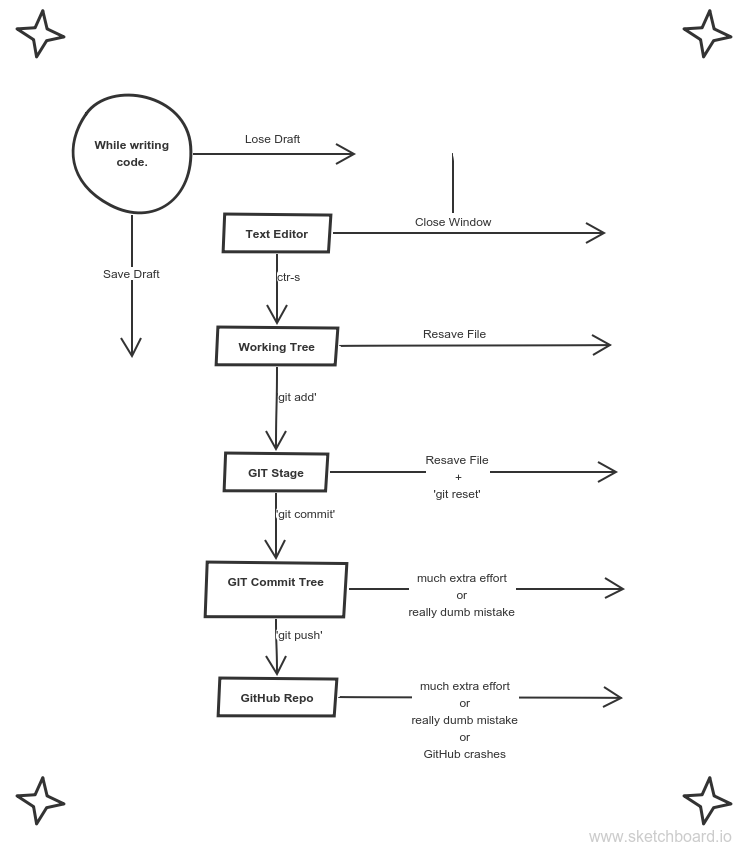

# Git & GitHub

In the colaborative world of web development, a project (or your piece of one) isn't finished until someone else can understand it - be it a co-worker, collaborator, yourself in a month, or some rando. GIT and Github allows you to protect your code against silly mistakes, organize, and document your code so others know how to use it and what to use it for.

### Index
* [git](#git)
* [github](#github)
* [git and github](#git-and-github)
* [resources](#resources)
* [assignments](#assignments)

---

## GIT 

* Git is a command-line application that allows you to travel through time.  Every commit saves a complete copy of your folder structure at the time of committing. 
* Git allows you to create alternative universes.  With branches you can save two versions of the same directory and flip between them, ie. one branch that works, and another with a broken experiment.  This is very practical for testing features, fixing bugs, or sharing work across a group.
* Git allows you to sync your folders with someone else's.  'Pull' and 'push' allows your local git commit tree to synchronize with a git repository located anywhere on the internet.  This is how you will use GitHub and how multiple people are able to collaborate on the same code base.

Git has more tricks up it's sleeves, but these 3 will be enough for now.

[TOP](#index)

---

## GitHub

Kind of like FaceBook, Linkedin, the library, and a playground for developers.  

You can develop & collaborate directly on GitHub when you're first learning.  When you're more advanced you'll be able to collaborate in any programming language using GitHub directly from your Terminal.  This is when you know you've made it into the big leagues.

For this first project you'll be building a basic portfolio directly from GitHub's website using Markdown, a very simple language for creating websites. You'll be starting very simple so you can get up and running asap.  The goal here is to have a single place to easily host and organize your projects.  You'll get a chance to make cooler portfolios in some of the later projects.

[TOP](#index)

---

## Git and GitHub

Git is like a really **epic save button** for your files and directories - officially Git is called a version control system.

To compare, a *save* in a text editor would record all of the words of a document as a single file. You are only ever given one record of the file like `essay.doc` unless you make duplicate copies (which would be difficult to remember to do and keep track of):

`essay-draft1.doc`, `essay-draft2.doc`, `essay-final.doc`

A *save* in Git however, would record differences of files and folders AND keep a **historical record of each save**. This feature is a game changer. As an individual developer, Git enables you to review how your project grows and to easily look at or restore file states from the past. Once connected to a network, Git allows you to push your project to GitHub for shari ng and collaborating with other developers.

While Git works on your *local* machine, GitHub is a *remote* storage facility on the web for all your coding projects. This means that by learning Git, you will get to showcase your portfolio on GitHub! This is really important because almost all software development companies consider the ability to use Git as an **essential skill for a modern web developer** to have; having a portfolio will provide proof to future potential employers as to what you are capable of.

In the next lesson we will go over the basic workflow of using Git which should enhance your understanding and demonstrate why Git is so useful.

And finally, you will set up a project with Git and this will serve as a template for setting up your future projects.

[TOP](#index)

---

## resources

* [learngitbranching.js.org](http://learngitbranching.js.org/)
* [THE Git video](https://www.youtube.com/watch?v=1ffBJ4sVUb4&list=TLj1nt5nzukA8)
* Roger Dudler's [handbook to using git](http://rogerdudler.github.io/git-guide/) - Cheat sheet with the most common commands.
* [A good introduction video](https://www.youtube.com/watch?v=r63f51ce84A), if you're into videos. 
* [Traversy Media crash course](https://www.youtube.com/watch?v=SWYqp7iY_Tc), another video intro.
* [Git CLI game](https://www.git-game.com).  A git tutorial run from your terminal.
* [Git and Github in plain English](https://blog.red-badger.com/blog/2016/11/29/gitgithub-in-plain-english).

[TOP](#index)

--- 

## assignments

### 1. Make a GitHub Account

* [How To](https://services.github.com/on-demand/intro-to-github/create-github-account)

Choosing a user name is important, it will stay with your FOREVER! It should be easy to remember and type, but still represent the true you.

### 2. learn some markdown

A very simple [markup language](https://www.lifewire.com/what-are-markup-languages-3468655) for making pretty (basic) documents.  The syntax is simple and there isn't very much of it.

* [Markdown Reference](https://guides.github.com/pdfs/markdown-cheatsheet-online.pdf)

### 3. turn you github account into your Portfolio

[Github Pages](https://pages.github.com) allows you to host static sites directly from your GitHub repositories. Create a new repository called "username".github.io, write a README.md to introduce yourself and link to your projects, go into settings and turn on github pages, and that's it! 

_an Example portfolio_

Here is [an example](https://elewa-student.github.io) of a GitHub portfolio.  Study how this interactive portfolio was built using only GitHub repos and GH-Pages hosting. Notice especially what all of the URLs are for the demos, code, and main portfolio. We expect your portfolio to be organized the same way.

_Helpful Resources_

* [Dan's Guide](http://dannguyen.github.io/github-for-portfolios/) - a little out of date
* [Deploying Your Portfolio](https://www.youtube.com/watch?v=cElzTD_x1xw)
* How to build a gh-pages site:  [from thinkful](https://www.thinkful.com/learn/a-guide-to-using-github-pages/), [from GitHub](https://help.github.com/articles/configuring-a-publishing-source-for-github-pages/), [a video](https://help.github.com/articles/configuring-a-publishing-source-for-github-pages/)
* How to keep a presentable GitHub account: [short](https://anti-pattern.com/github-is-your-resume-now),  [long](http://blog.gainlo.co/index.php/2015/11/13/how-to-make-github-as-your-new-resume/) 

[TOP](#index)

___
___
### <a href="http://janke-learning.org" target="_blank"></img> Janke Learning</a>
